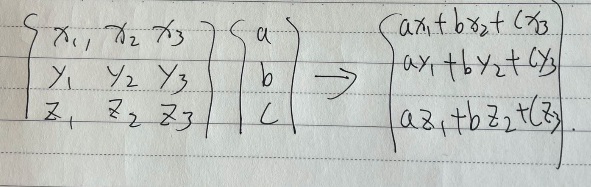
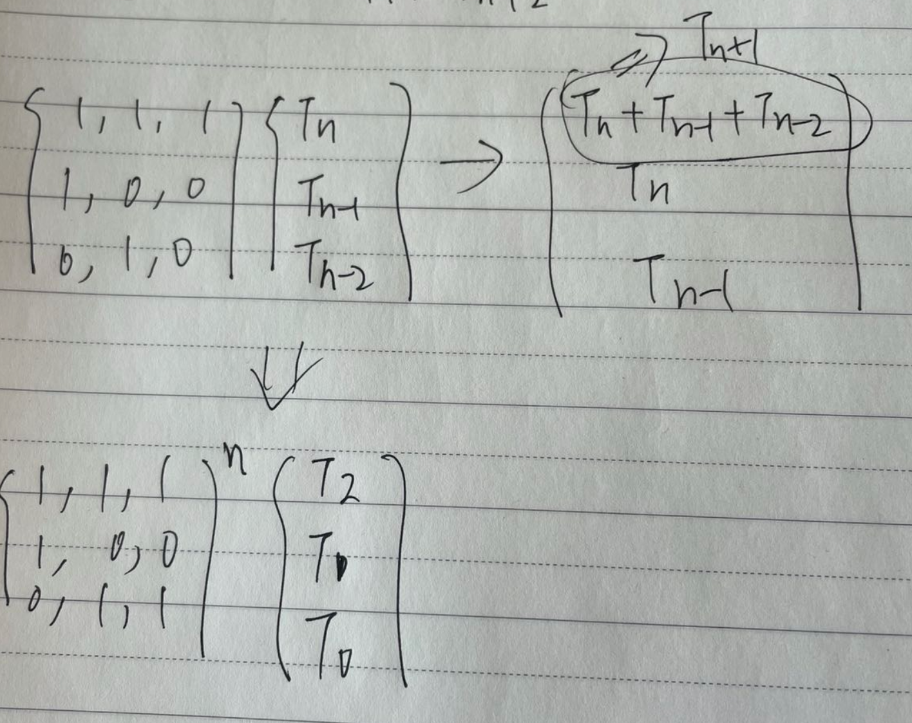

### 解题思路  第 N 个泰波那契数

#### 分析
我们先复习一下矩阵运算

我们再看看本题的公式
Tn+3 = Tn + Tn+1 + Tn+2

是否能找到关联？我们不妨大胆假设，取公式右侧Tx的因子作为特征矩阵的第一行。
那么，特征矩阵的第一行为{1， 1， 1}。
代入矩阵运算

代入矩阵矩阵后，很容易发现第一行与行向量相乘正好是Tn+1，我们只需找到特征矩阵使得
第二，第三行(相乘结果)为Tn和Tn-1即可

其实这个特征矩阵不是唯一的，只要通过矩阵运算可以推倒出特征矩阵的n次方
相乘已知常量即可。

